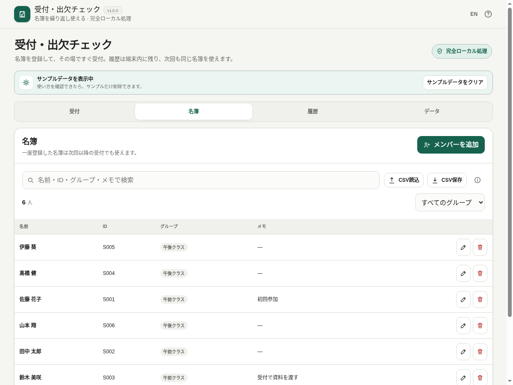

# Check-in Desk / 受付・出欠チェック

[](https://github.com/ttomohisa/htmlapps-check-in-desk/actions/workflows/deploy-pages.yml)
[](LICENSE)
[](https://ttomohisa.github.io/htmlapps-check-in-desk/)

[English README](README.md)

繰り返し使える名簿で、受付・出欠・入退室をブラウザーだけで記録する単一HTMLアプリです。名簿や受付履歴をアプリのサーバーへ送信せず、1台の端末で受付を始め、履歴確認やCSV / JSON保存まで行えます。

## 🚀 デモ

### [GitHub PagesでCheck-in Deskを開く](https://ttomohisa.github.io/htmlapps-check-in-desk/)

GitHub Pagesから最初のHTMLを読み込んだ後、名簿管理・受付記録・履歴表示・CSV入出力・JSONバックアップ / 復元はブラウザー内で処理されます。名簿や受付履歴がこのアプリから外部サーバーへ送信されることはありません。

[](https://ttomohisa.github.io/htmlapps-check-in-desk/)

## 主な機能

- **同じ名簿を何度でも利用** — 名前・任意ID・グループ・メモを登録し、次回以降の受付でもそのまま使えます。
- **2種類の受付方法** — 1人につき受付状態を記録する**受付**と、入室・退室・再入室を時系列で残す**入退室**に対応します。
- **受付現場で素早く操作** — 未受付 / 受付済み / すべて、グループ絞り込み、名前 / ID / グループ検索に対応。対象が1人に絞れたらEnterでも記録できます。
- **受付専用表示** — 受付中は名簿・履歴・データ管理の導線やスマホ下部ナビを隠し、受付操作に集中できます。
- **当日参加にも対応** — 名簿にいない人を今回だけ追加するか、そのまま次回用の名簿にも追加できます。
- **誤操作と後からの訂正を分離** — 直後のトーストUndoは誤タップとして記録自体を戻し、あとから「最近の受付」で戻した操作は訂正履歴として残します。
- **繰り返しの出席を確認** — 終了した受付の詳細、個人履歴、受付名変更、再開、出席マトリクス、1件単位の履歴削除＋Undoに対応します。
- **CSV / JSONを必要なときだけ保存** — 名簿CSVは重複候補・読み飛ばし行を確認してから追加。名簿CSV、全履歴CSV、受付1回分CSV、アプリ全体のJSONバックアップを保存できます。
- **完全ローカル処理** — アカウント、バックエンド、アナリティクス、テレメトリー、クラウドDB、AIモデル、外部ランタイム依存はありません。

## すぐに使う

### Webで使う

[デモを開く](https://ttomohisa.github.io/htmlapps-check-in-desk/)だけで利用できます。インストールやアカウント登録は不要です。

### 単一HTMLを使う

1. このリポジトリをダウンロードまたはクローンします。
2. Windowsで `build-standalone.bat` を実行します。
3. 生成された `dist/index.html` を任意の場所へコピーします。
4. そのHTMLを現在のブラウザーで開きます。

このアプリには実行時に取得する依存パッケージはありません。リポジトリのテンプレート用ビルド処理で単一HTMLを生成・検証します。

### 小さい自己展開版を使う

ビルドすると `dist/index.self-extract.html` も生成します。通常版HTMLをgzip圧縮した状態で内包し、開いたときに `DecompressionStream` で端末内展開します。

展開時もアプリデータの外部送信はありません。

## 使い方

1. **名簿**でメンバーを追加するか、CSVを読み込みます。CSVは追加前に重複候補・読み飛ばし行を確認できます。
2. **受付**から**新しい受付を開始**し、全メンバーまたは対象グループを選びます。
3. **受付**または**入退室**を選びます。
4. 到着した人を検索して記録します。受付台では**受付専用表示**に切り替えられ、対象が1人ならEnterでも記録できます。
5. 名簿にいない人は**当日参加者を追加**から登録します。必要なら次回用の名簿にも追加できます。
6. 受付を終了し、**履歴**で結果を確認します。履歴はユーザーが削除するかブラウザー保存領域が消えるまで端末内に残ります。
7. 必要に応じて名簿 / 履歴CSVを保存し、端末移行やブラウザーデータ削除の前にはJSONバックアップを保存します。

### 名簿CSV

ヘッダー付きの場合は次の列を認識します。

```csv
name,id,group,note
田中太郎,001,営業,
佐藤花子,002,開発,受付時に資料を渡す
```

日本語の `名前` / `氏名`、`グループ` / `所属`、`メモ` / `備考` にも対応します。対応する見出しがない場合は1列目を名前として読み込みます。余分な列は無視します。

読み込み前には以下を確認できます。

- 追加予定の人数
- 同じIDまたは同じ名前の重複候補
- 同じID・別名 / 同じ名前・別IDの競合候補
- 名前が空、または入力上限を超えた読み飛ばし行

重複候補は初期状態では追加対象から外し、必要な場合だけ明示的に追加できます。1回のCSV読込は最大5,000人です。名簿画面のCSV読込横にあるインフォアイコンから、同じ説明とCSVテンプレート保存を利用できます。

受付の開始・再開時は検索とグループ絞り込みを解除し、「未受付」に戻ります。選択中の絞り込みは支援技術にも伝わります。日本語などの変換確定中やEnterの押し続けでは記録しません。変換確定後、必要に応じて改めてEnterを押してください。

### キーボード操作

| ショートカット | 操作 |
| --- | --- |
| `Enter` | 受付検索で操作可能な対象が1人のとき、その人を記録 |
| `/` | 受付中に検索欄へフォーカス |
| `Esc` | 開いているダイアログを閉じる。受付専用表示では検索文字を先に消し、その後管理画面へ戻る |

### サンプルデータと回帰テスト用ファイル

初回起動時は、小さなサンプル名簿と2回分の終了済み受付履歴を表示します。画面上部の案内から最初から入っているサンプルだけを削除でき、自分で追加したデータは残ります。削除後も**データ → サンプルデータを表示**から、現在のデータを置き換えずに再表示できます。

`test-data/` には回帰確認用ファイルを含めています。

- `check-in-roster-test.csv` — ID、グループ、メモ、引用符付きカンマ、UTF-8 BOMを含む通常の名簿CSV。
- `check-in-roster-edge-cases.csv` — ID / 名前の重複、空の名前、余分な列などの境界ケース。
- `check-in-roster-1000.csv` — 読込・絞り込み・検索確認用の1,000人名簿。
- `check-in-desk-backup-test.json` — 名簿と過去の受付履歴を含むJSONバックアップ。

## GitHub Pagesで公開する

このリポジトリには、単一HTMLをビルドしてGitHub Pagesへ公開するワークフローが含まれています。

1. リポジトリ名を `htmlapps-check-in-desk` としてGitHubへプッシュします。
2. **Settings → Pages → Build and deployment → Source** で **GitHub Actions** を選択します。
3. `main` へプッシュするか、Actions画面から **Deploy standalone app to GitHub Pages** を手動実行します。
4. ビルド成功後、`https://ttomohisa.github.io/htmlapps-check-in-desk/` で公開されます。

`main` へのプッシュ時には単一HTMLを再生成し、リポジトリ検証を通してから公開します。

## 開発とビルド

```text
.
├─ src/index.template.html       # アプリ本体
├─ app.config.json               # アプリ情報・バージョン・ビルド設定
├─ dependencies.json             # 実行時依存の宣言（このアプリは空）
├─ build-standalone.bat          # Windows用ビルド入口
├─ build-standalone.ps1          # 単一HTML生成処理
├─ scripts/                      # ビルド・リポジトリ・自己展開版の検証
├─ test-data/                    # CSV / JSON回帰テスト用データ
├─ assets/
│  ├─ favicon.svg
│  ├─ screenshot.png
│  ├─ screenshot-en.png
│  └─ screenshot-mobile.png
└─ dist/
   ├─ index.html
   └─ index.self-extract.html
```

### ビルドと確認

Windows:

```bat
build-standalone.bat
```

リポジトリ全体を確認:

```powershell
./scripts/check-repository.ps1
```

リポジトリ検証には、追加パッケージ不要の受付回帰テスト用にNode.js 18以上が必要です。ソース・生成HTML・ルート配布版を日本語と英語で確認します。ビルド後にテストだけ実行する場合: `node tests/reception-controls.test.mjs`。

生成済みアプリを開く:

```bat
start-local.bat
```

リリース時の回帰チェック項目は [VERIFY_OFFLINE.md](VERIFY_OFFLINE.md) を確認してください。

## プライバシーと通信防止

- 名簿と受付履歴はブラウザーの `localStorage` に保存します。
- バックエンド、アナリティクス、テレメトリー、広告SDK、アカウント、クラウドDBはありません。
- 生成HTMLのContent Security Policyには `connect-src 'none'` を設定しています。
- CSV / JSONはユーザーが保存操作を行ったときだけ作成します。
- ブラウザー保存領域は永続バックアップではありません。サイトデータ削除、ブラウザーや端末のポリシー等で消える場合があります。

残しておきたい名簿・履歴はJSONバックアップを保存してください。CSV / JSONには氏名や出欠情報が含まれる場合があり、このアプリでは暗号化しません。保存・共有時は利用環境のルールに従って扱ってください。

## 対応ブラウザー / 端末

現在のChrome / Edgeを主要なリリース対象とします。Firefox / Safariでも、このアプリが必要とする標準ブラウザーAPIだけで動く構成ですが、リポジトリの自動リリース検証には含めていません。

`dist/index.html` は `file://` で直接開ける構成です。自己展開版では追加で `DecompressionStream` が必要です。

## 制限事項

- 複数端末間の自動同期や同時共同編集はありません。
- 別端末の変更とJSON復元内容を自動でマージする機能はありません。
- 本人確認、セキュリティゲート、改ざん防止監査、法的な出席証明を目的としたシステムではありません。
- ブラウザー保存領域はユーザー操作、ブラウザー、端末ポリシー、プライベートブラウズ等で消える場合があります。
- QRコード、カメラ、顔認識、招待、決済、チケット販売、クラウド型イベント管理は意図的に含めていません。
- 受付履歴はユーザーが削除するかブラウザー保存領域が消えるまで端末内に残ります。保存したファイルは利用する組織・イベントのルールに従って管理してください。

## 使用ライブラリ

Check-in Deskには**外部ランタイム依存がありません**。ブラウザー標準のHTML / CSS / JavaScript、Web Storage、File API、Blob URLと、このリポジトリに含まれるビルドツールだけを使用します。

詳細は [THIRD_PARTY_NOTICES.md](THIRD_PARTY_NOTICES.md) を確認してください。

## コントリビューション

バグ報告や機能提案はIssueからお願いします。開発への参加方法は [CONTRIBUTING.md](CONTRIBUTING.md)、製品仕様は [APP_SPEC.md](APP_SPEC.md) を確認してください。

## ライセンス

Copyright © 2026 ttomohisa

このプロジェクトは [MIT License](LICENSE) で公開されています。
