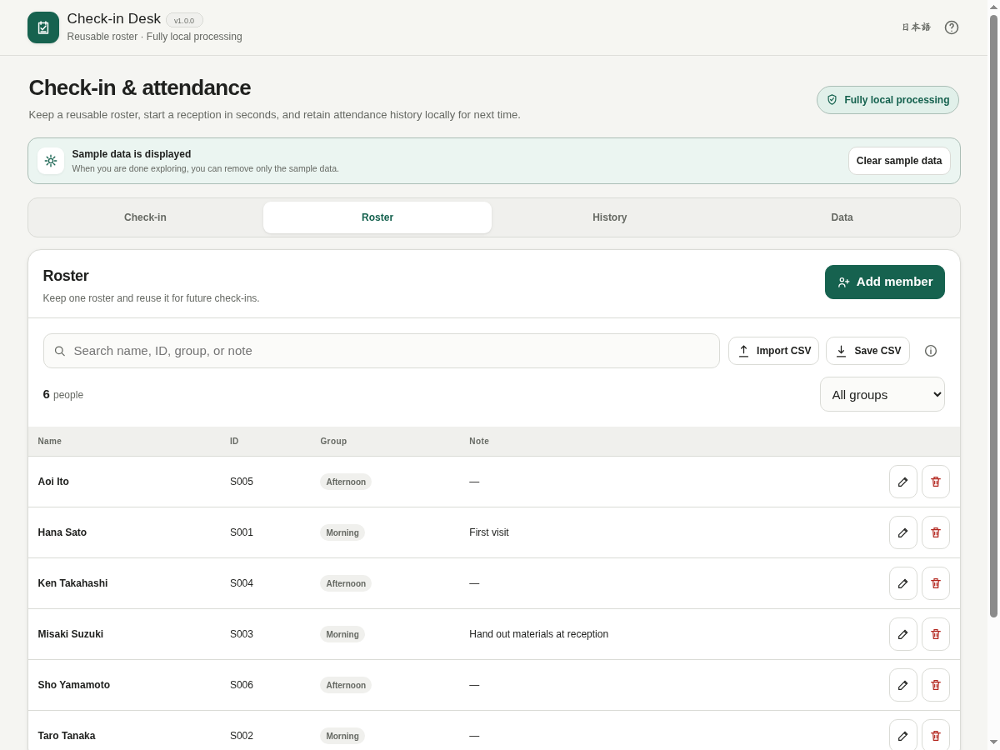

# Check-in Desk

[](https://github.com/ttomohisa/htmlapps-check-in-desk/actions/workflows/deploy-pages.yml)
[](LICENSE)
[](https://ttomohisa.github.io/htmlapps-check-in-desk/)

[日本語版 README](README.ja.md)

A privacy-focused, single-HTML check-in and attendance tracker for reusable rosters. Keep a roster on one device, run repeated check-in or entry/exit sessions, review history, and export CSV or JSON without sending roster or attendance data to an application server.

## 🚀 Live demo

### [Open Check-in Desk on GitHub Pages](https://ttomohisa.github.io/htmlapps-check-in-desk/)

GitHub Pages delivers the initial HTML. After it loads, roster management, check-in records, history, CSV import/export, and JSON backup/restore are processed locally in the browser. The app does not upload roster or attendance data to an application server.

[](https://ttomohisa.github.io/htmlapps-check-in-desk/)

## Features

- **Reuse one roster** — Keep names, optional IDs, groups, and notes, then use the same roster for later check-ins.
- **Run two reception styles** — Use **Check-in** for one attendance state per person, or **Entry / Exit** for repeated entry, exit, and re-entry records.
- **Work quickly at the desk** — Filter Pending / Checked in / All, narrow by group, search by name / ID / group, and press Enter when one actionable result remains.
- **Switch to a focused reception view** — Hide roster, history, data-management navigation, and the mobile bottom bar while the desk is active.
- **Handle walk-ins without breaking the flow** — Add a person for the current session only, or add them to the reusable roster at the same time.
- **Keep corrections understandable** — Immediate toast Undo removes an accidental just-recorded action; later corrections from Recent activity remain in the session activity history.
- **Review repeated attendance** — Keep completed sessions, inspect per-person history, reopen a session, rename it, view an attendance matrix, and remove an old session with confirmation and Undo.
- **Import and export practical files** — Review roster CSV duplicates / skipped rows before import, save roster CSV, save filtered reception CSV with an editable filename, save all-history or per-session CSV, and save / restore a complete JSON backup.
- **Stay local by design** — No account, backend, analytics, telemetry, cloud database, model, or third-party runtime dependency is required.

## Quick start

### Use the web demo

Just [open the demo](https://ttomohisa.github.io/htmlapps-check-in-desk/). No installation or account is required.

### Use the standalone HTML

1. Download or clone this repository.
2. Run `build-standalone.bat` on Windows.
3. Copy `dist/index.html` wherever you need it.
4. Open the single file in a current browser.

The app has no runtime package download. The build uses the repository template tooling to generate and verify the standalone files.

### Use the smaller self-extracting HTML

The build also generates `dist/index.self-extract.html`. It contains a gzip-compressed copy of the readable standalone HTML and expands it locally with `DecompressionStream` when opened.

No application data is uploaded during unpacking.

## Usage

1. Add people under **Roster**, or import a roster CSV and review possible duplicates / skipped rows before adding it.
2. Under **Check-in**, choose **Start new check-in** and select all members or one group.
3. Choose **Check-in** or **Entry / Exit** mode.
4. Search for arriving people and record them. At a staffed desk, **Reception view** hides management navigation. When one actionable search result remains, press Enter to record it.
5. Use **Add walk-in** for someone not already on the roster. You can optionally add that person to the reusable roster too.
6. End the check-in and review it under **History**. Completed sessions remain on the device until you delete them or clear browser storage.
7. Export roster / history CSV when needed, and save a JSON backup before moving devices or clearing browser data.

### Export the shown reception

Use **Export shown CSV (N)** beside the reception filters to save only the people currently displayed, in the same order. Status, group and name / ID / group search are combined. The action is disabled when nothing is shown.

The dialog captures the rows at opening and lets you edit the filename before saving. Cancel, close, Escape or the backdrop discard that snapshot; reopening captures fresh rows. Ending, replacing or restoring a session cancels an unsaved export. In Entry / Exit mode, **Checked in** includes people who have entered and later exited. All-history and per-session CSV still export their complete scopes. Literal group names such as `__ungrouped__` are distinct from **No group**.

### Roster CSV

With a header row, these columns are recognized:

```csv
name,id,group,note
Alex Chen,001,Sales,
Morgan Lee,002,Engineering,Hand out the welcome pack
```

Common Japanese headers are also recognized. Without a recognized header, the first column is treated as the member name. Extra columns are ignored.

Before changing the roster, the import review shows:

- People that will be added
- Possible duplicates based on matching ID or name
- Same-ID / different-name and same-name / different-ID conflicts
- Rows skipped because the name is empty or a value exceeds the supported field length

Possible duplicates are excluded by default unless you explicitly include them. Up to 5,000 people can be imported in one CSV operation. The same format guide and a downloadable template are available from the info icon beside CSV import.

Starting or reopening a session clears the reception search and group filter and shows Pending. The selected filter is also announced to assistive technology. IME composition confirmation and holding Enter do not record attendance; press Enter again deliberately after confirming the text.

### Keyboard shortcuts

| Shortcut | Action |
| --- | --- |
| `Enter` | Record the action when reception search has exactly one actionable result |
| `/` | Focus reception search while a check-in is active |
| `Esc` | Close an open dialog; in Reception view, clear search first, then leave the focused view |

### Sample data and regression files

On first use, Check-in Desk shows a small sample roster and two completed sample sessions. The sample-data banner can remove only the built-in sample content; your own data stays. After clearing it, use **Data → Show sample data** to add the sample again without replacing your data.

Regression fixtures are included in `test-data/`:

- `check-in-roster-test.csv` — normal roster CSV with IDs, groups, notes, quoted commas, and UTF-8 BOM.
- `check-in-roster-edge-cases.csv` — duplicate IDs / names, empty names, extra columns, and other import edge cases.
- `check-in-roster-1000.csv` — 1,000-member roster for import, filtering, and search checks.
- `check-in-desk-backup-test.json` — complete JSON backup with a roster and historical sessions.

## Publish with GitHub Pages

This repository includes a workflow that builds the standalone HTML and deploys it to GitHub Pages.

1. Push the repository to GitHub as `htmlapps-check-in-desk`.
2. Open **Settings → Pages → Build and deployment → Source** and select **GitHub Actions**.
3. Push to `main`, or manually run **Deploy standalone app to GitHub Pages** from the Actions tab.
4. After a successful deployment, the demo is available at `https://ttomohisa.github.io/htmlapps-check-in-desk/`.

Each push to `main` rebuilds the standalone files and runs the repository verification before publishing.

## Development and build layout

```text
.
├─ src/index.template.html       # Application source
├─ app.config.json               # App identity, version, and build settings
├─ dependencies.json             # Runtime dependency declaration (empty for this app)
├─ build-standalone.bat          # Windows build entry point
├─ build-standalone.ps1          # Standalone HTML builder
├─ scripts/                      # Build / repository / self-extract verification
├─ test-data/                    # CSV / JSON regression fixtures
├─ assets/
│  ├─ favicon.svg
│  ├─ screenshot.png
│  ├─ screenshot-en.png
│  └─ screenshot-mobile.png
└─ dist/
   ├─ index.html
   └─ index.self-extract.html
```

### Build and verify

On Windows:

```bat
build-standalone.bat
```

Run the repository checks:

```powershell
./scripts/check-repository.ps1
```

Repository checks require Node.js 18+ for dependency-free reception regressions. They exercise the source, built HTML, and root download in Japanese and English. To run just these tests after building: `node tests/reception-controls.test.mjs`.

Open the generated app with the included helper:

```bat
start-local.bat
```

See [VERIFY_OFFLINE.md](VERIFY_OFFLINE.md) for the release regression checklist.

## Privacy and runtime network protection

- Roster and check-in history are stored in browser `localStorage`.
- The app has no backend, analytics, telemetry, advertising SDK, account, or cloud database.
- The generated HTML contains a Content Security Policy with `connect-src 'none'`.
- CSV / JSON files are created only after an explicit save action.
- Browser storage is not a durable backup. Clearing site data, browser policy, or device cleanup can remove it.

Save a JSON backup for roster / history data you need to keep or move to another device. Exported CSV and JSON files can contain names and attendance information and are not encrypted by this app.

## Browser support

Current Chrome and Edge are the primary release targets. Firefox and Safari use only standard browser APIs required by this app and are intended to work, but they are not part of the repository's automated release validation.

`dist/index.html` is designed to work when opened directly with `file://`. The self-extracting variant additionally requires `DecompressionStream`.

## Limitations

- There is no automatic multi-device synchronization or simultaneous shared editing.
- Reopening or restoring data on one device does not merge changes from another device.
- The app is not an identity-verification system, security access gate, tamper-resistant audit system, or legal attendance register.
- Browser storage can be cleared by the user, browser, device policy, or private-browsing behavior.
- QR-code, camera, facial-recognition, invitation, payment, ticketing, and cloud event-management features are intentionally not included.
- Attendance history is kept on the device until the user deletes it or browser storage is cleared; manage exported files according to the rules that apply to the event or organization.

## Dependencies

Check-in Desk has **no third-party runtime dependencies**. The app uses browser-native HTML, CSS, JavaScript, Web Storage, File APIs, Blob URLs, and the build tooling included in this repository.

See [THIRD_PARTY_NOTICES.md](THIRD_PARTY_NOTICES.md) for details.

## Contributing

Bug reports and feature proposals are welcome through GitHub Issues. See [CONTRIBUTING.md](CONTRIBUTING.md) for development guidance and [APP_SPEC.md](APP_SPEC.md) for the product contract.

## License

Copyright © 2026 ttomohisa

Licensed under the [MIT License](LICENSE).
